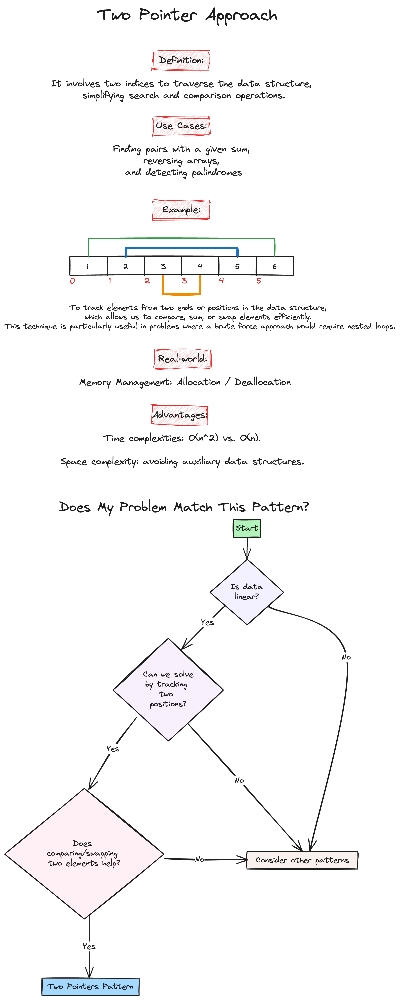
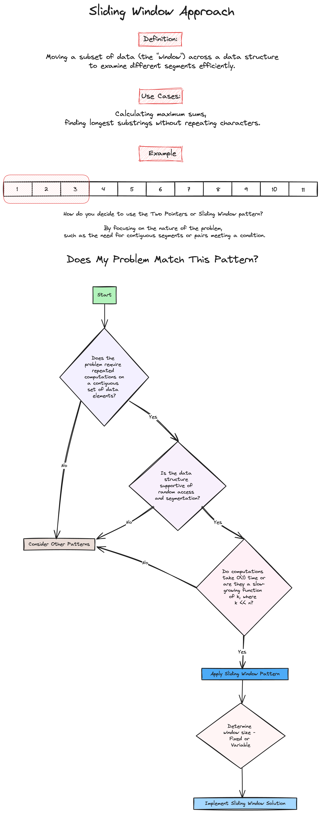

# Week 1: Lists, Arrays, and Sorting

Welcome to the first week of our LeetCode Bootcamp. This week, we will dive into Lists, Arrays, and Sorting in Python, alongside introducing powerful problem-solving patterns like the Two-Pointer Approach and the Sliding Window Technique.

## Class Agenda (2 Hours)

### 1. Overview of the Bootcamp Syllabus

- Introduction to the course structure
- Objectives and outcomes

### 2. Python Overview of Lists, Arrays, and Sorting

Please review the following resources:

- [Exercism: Python Lists](https://exercism.org/tracks/python/concepts/lists)
- [Python.org: List Comprehensions](https://docs.python.org/3/tutorial/datastructures.html#list-comprehensions)
- [Python.org: Sequence Types - list, tuple, range](https://docs.python.org/3/library/stdtypes.html#sequence-types-list-tuple-range)
- [Python.org: Sorting HOW TO](https://docs.python.org/3/howto/sorting.html#)
- [Real Python: Python Lists and Tuples](https://realpython.com/python-lists-tuples/) 

### 3. Pattern Introduction

- Two-Pointer Approach

- Sliding Window Technique



### 4. Problems Covered This Week

- [Merge Intervals](https://leetcode.com/problems/merge-intervals/description/)

#### Brute Force Approach

A simple approach is to start from the first interval and compare it with all other intervals for overlapping, if it overlaps with any other interval, then remove the other interval from the list and merge the other into the first interval. Repeat the same steps for the remaining intervals after the first.

Time Complexity: O(n^2)

```python
# Optimized Solution 
    def merge(self, intervals: List[List[int]]) -> List[List[int]]:   
        merged = []
        #  Sort the intervals based on their start times
        intervals.sort(key=lambda x: x[0])
        prev = intervals[0]
        for interval in intervals[1:]:
            #If the start time of current interval <=  end time of the prev interval
            if interval[0] <= prev[1]:
                prev[1] = max(prev[1], interval[1])
            else:
                #Intervals don't overlap, add the prev interval to the merged list
                merged.append(prev)
                prev = interval
        #Adding the Last Interval
        merged.append(prev)
        return merged

# Time Complexity: O(nlogn)
```

- [Best time to buy and sell stock](https://leetcode.com/problems/best-time-to-buy-and-sell-stock/)
- [Container With Most Water](https://leetcode.com/problems/container-with-most-water/)
- [Maximum Product Subarray](https://leetcode.com/problems/maximum-product-subarray/description/)

### 5. Homework Problems 

- [Two Sum II - Input Array Is Sorted](https://leetcode.com/problems/two-sum-ii-input-array-is-sorted/description/)
- [Products of array discluding self](https://leetcode.com/problems/product-of-array-except-self/description/)
- [Sort Colors](https://leetcode.com/problems/sort-colors/description/)

 
